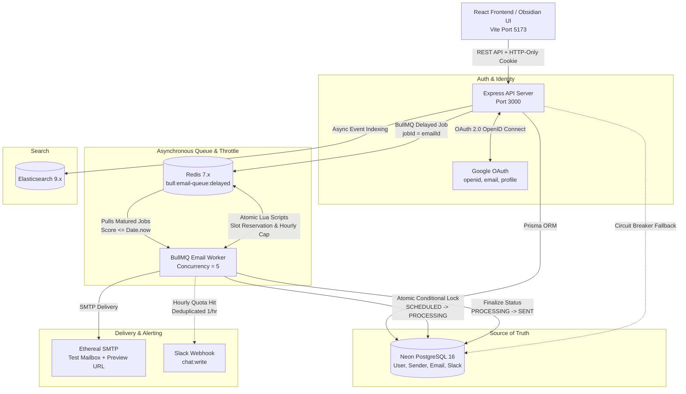

# PreachInbox Sched

A robust, production-minded email scheduling, rate-limiting, and delivery platform built for high throughput, restart resilience, and zero duplicate dispatches. Features an Express & BullMQ backend engine paired with a modern obsidian-dark React frontend dashboard.

---

## 🌐 Live Production Deployment

The backend service is deployed and live on cloud infrastructure:

| Resource | Public URL | Description |
| :--- | :--- | :--- |
| **API Base URL** | [`https://preach-inbox-api.onrender.com`](https://preach-inbox-api.onrender.com) | Production REST API on Render |
| **Live Health Probe** | [`https://preach-inbox-api.onrender.com/health`](https://preach-inbox-api.onrender.com/health) | Real-time DB, Redis & Elasticsearch latency probes |
| **BullMQ Admin Dashboard** | [`https://preach-inbox-api.onrender.com/admin/queues/`](https://preach-inbox-api.onrender.com/admin/queues/) | Visual queue & job monitoring UI (Bull Board) |
| **Privacy Policy** | [`https://preach-inbox-api.onrender.com/privacy-policy`](https://preach-inbox-api.onrender.com/privacy-policy) | Public privacy policy for Google OAuth compliance |

---

## 📖 Table of Contents

1. [Architecture Overview](#-architecture-overview)
   - [How Scheduling Works](#1-how-scheduling-works-strictly-no-cron)
   - [How Persistence on Restart is Handled](#2-how-persistence-on-restart-is-handled)
   - [How Rate Limiting & Concurrency are Implemented](#3-how-rate-limiting--concurrency-are-implemented)
2. [Features Implemented (Backend & Frontend)](#-features-implemented)
3. [Environment Variables & Ethereal Setup](#-environment-variables--ethereal-email-setup)
   - [Setting up Ethereal Email](#setting-up-ethereal-email)
   - [Backend Environment Variables](#backend-environment-variables-backendenv)
   - [Frontend Environment Variables](#frontend-environment-variables-frontendenv)
4. [Step-by-Step Quick Start](#-step-by-step-quick-start)
   - [Prerequisites](#1-prerequisites)
   - [Running the Backend](#2-running-the-backend)
   - [Running the Frontend](#3-running-the-frontend)
5. [Automated Tests & Verification Scripts](#-automated-tests--verification-scripts)
6. [Engineering Documentation Index](#-engineering-documentation-index)

---

## 🏗️ Architecture Overview



### 1. How Scheduling Works (Strictly NO Cron)

Traditional email schedulers rely on cron loops running periodic queries (e.g. `SELECT * FROM "Email" WHERE scheduledAt <= NOW()`). This architecture strictly rejects cron:
- **No Interval Lag**: Cron intervals (e.g. every 60s) introduce arbitrary dispatch delay.
- **No Database Polling**: Cron taxes database CPU, disk I/O, and pool connections 24/7 even when no emails are scheduled.
- **Millisecond-Precision BullMQ Delayed Jobs**:
  - When an email is scheduled, BullMQ calculates: `delay = Math.max(0, scheduledAt.getTime() - Date.now())`.
  - BullMQ inserts the job into a Redis Sorted Set (`bull:email-queue:delayed`).
  - The job's score in the sorted set is the **exact target epoch millisecond**.
  - Redis wakes the worker exactly when the timestamp matures. The relational database is never polled.

### 2. How Persistence on Restart is Handled

- **Durable Redis Sorted Sets**:
  - Scheduled jobs reside in `bull:email-queue:delayed` backed by Redis memory and disk snapshots (RDB/AOF).
  - No jobs are re-created or re-seeded when the API server or worker process boots.
- **No "Day 1" Resets**:
  - If an email is scheduled 3 days in the future, the server can reboot repeatedly; the target epoch millisecond score in Redis remains unchanged.
- **Worker Catch-Up on Boot**:
  - If the server or worker is offline when a job matures, upon restarting BullMQ instantly recognizes that the job's score is $\le \text{Date.now()}$, moves it from `delayed` to `active`, and executes it immediately.
- **Automated Verification**:
  - Verified by [`backend/tests/queue-restart.test.ts`](backend/tests/queue-restart.test.ts): delayed jobs are added, workers are killed, delay matures while offline, fresh workers are started, and jobs are delivered cleanly without data loss.

### 3. How Rate Limiting & Concurrency are Implemented

- **Worker Concurrency Pool**:
  - The BullMQ worker is instantiated with `concurrency: 5` (configurable via `WORKER_CONCURRENCY`), allowing 5 jobs to be processed concurrently across the Node.js event loop.
- **Zero Event-Loop Blocking (`no sleep()`)**:
  - Workers never execute `await sleep(2000)` to throttle dispatch rates. Sleeping inside a worker thread blocks concurrency slots and wastes resources.
  - Instead, the worker executes **atomic Redis Lua scripts**:
- **Inter-Email Spacing ($2000\text{ms}$ delay per sender)**:
  - An atomic Lua script (`RESERVE_SPACING_SLOT_LUA`) inspects `email-delay:{senderId}`.
  - If `< 2000ms` has passed since the last email from that sender, it calculates the required wait time and reschedules the job via `job.moveToDelayed(Date.now() + waitMs, token)`.
  - The worker immediately yields the tick, allowing the thread to service emails for other senders without delay.
- **Hourly Quotas ($200\text{ emails/hr}$ per sender)**:
  - An atomic Lua script (`CHECK_AND_INCR_HOURLY_LUA`) tracks discrete UTC hour buckets: `email-rate:{senderId}:{YYYY-MM-DD-HH}`.
  - If the counter exceeds $200$, the email is rescheduled for the top of the next UTC hour window (zero emails are dropped).
  - Triggers a deduplicated Slack alert (at most 1 alert per sender per hour).
- **3-Layer Idempotency & Concurrency Lock**:
  1. **Deterministic BullMQ Job ID**: `jobId = email.id` prevents duplicate job creation in Redis.
  2. **Pre-Execution Database Guard**: Worker checks PostgreSQL; skips immediately if status is not `SCHEDULED`.
  3. **Atomic Conditional SQL Transition**: `UPDATE "Email" SET status = 'PROCESSING' WHERE id = :id AND status = 'SCHEDULED'`. Only 1 worker can acquire the lock; any duplicate worker cleanly aborts.

---

## 🌟 Features Implemented

| Domain | Feature | Description |
| :--- | :--- | :--- |
| **Backend** | **Millisecond Delay Scheduler** | BullMQ delayed queue backed by Redis sorted sets; zero cron loops, zero database polling. |
| **Backend** | **Restart Durability** | Redis sorted set persistence; matured jobs catch up automatically upon reboot with zero loss. |
| **Backend** | **Inter-Email Rate Limiting** | Atomic Lua leaky-bucket reservation enforcing minimum 2,000ms spacing between emails per sender. |
| **Backend** | **Hourly Sender Quotas** | Atomic Lua counter capping senders at 200 emails/hr; excess jobs auto-rescheduled for the next UTC hour. |
| **Backend** | **Slack Quota Alerting** | Slack OAuth 2.0 webhook alerting when limits are hit, deduplicated to max 1 alert per sender per hour. |
| **Backend** | **Dual Authentication** | Google OAuth 2.0 OpenID Connect + Email/Password with `bcryptjs` hashing. Secure `HttpOnly` JWT cookies. |
| **Backend** | **Resilient Search Engine** | Multi-match search across recipient, subject, and body via Elasticsearch 9.x with PostgreSQL `ILIKE` fallback. |
| **Backend** | **Bull Board Admin UI** | Visual queue dashboard mounted at `/admin/queues` showing active, delayed, completed, and failed jobs. |
| **Backend** | **Ethereal SMTP Sandbox** | Safe test email dispatch via Nodemailer; generates web preview URLs per sent email. |
| **Frontend** | **Obsidian-Dark UI Design** | Pixel-perfect aesthetic featuring modern obsidian dark tokens, dual-pane layouts, glassmorphic modals, and micro-animations. |
| **Frontend** | **Authentication & Dev Bypass** | Google OAuth login, branded callback screen, Email/Password forms, and 1-click `Dev Login Bypass`. |
| **Frontend** | **Scheduled Mailbox Feed** | Table of scheduled jobs featuring warm peach badges and live countdowns (e.g. `🕒 Tue 9:15 AM`). |
| **Frontend** | **Sent Mailbox Feed** | Real-time table of dispatched emails with emerald `✓ Sent` status badges and delivery timestamps. |
| **Frontend** | **Interactive Star Filter** | Toggle stars on any email with `localStorage` persistence and quick header filter (`All` vs `Starred`). |
| **Frontend** | **Full Email Detail Inspector** | Slide view displaying full sender identity, recipient chips, timestamps, raw body, and Ethereal preview links. |
| **Frontend** | **Bulk CSV Lead Importer** | Drag-and-drop or file picker for CSV/TXT lead lists; automatically parses and deduplicates email chips. |
| **Frontend** | **Rich Compose & Send Later** | Rich-text formatting toolbar, custom throttling controls (`delayMs`, `hourlyLimit`), and "Send Later" popover with date/time pickers and quick presets. |
| **Frontend** | **Instant Real-Time Search** | Dual-layer search: instant client-side filtering + 250ms debounced backend search with fallback. |
| **Frontend** | **Preferences Drawer** | Slide-in drawer for Slack connection, direct BullMQ dashboard launch, Ethereal test senders sandbox, and theme toggling. |

---

## ⚙️ Environment Variables & Ethereal Email Setup

### Setting up Ethereal Email

[Ethereal Email](https://ethereal.email) is a safe, fake SMTP service where emails are never delivered to real people. Instead, every email is captured and viewable in a web browser.

You have three convenient ways to use Ethereal in this project:

1. **Automatic Dynamic Account (Zero Setup)**:
   - If `ETHEREAL_USER` and `ETHEREAL_PASSWORD` are left blank in `backend/.env`, Nodemailer automatically creates a dynamic Ethereal test account on the fly when the first email is sent.
2. **Persistent Ethereal Account (Recommended)**:
   - Visit [ethereal.email/create](https://ethereal.email/create) to generate a username and password.
   - Paste them into your `backend/.env` under `ETHEREAL_USER` and `ETHEREAL_PASSWORD`.
   - All sent emails can then be inspected directly in that single inbox on [ethereal.email](https://ethereal.email).
3. **In-App Preferences Sandbox**:
   - In the frontend dashboard, open the **Preferences Drawer** (gear icon) ➔ **Email Senders Sandbox**.
   - Click **+ Add Sender** to create a test identity. Click **View inbox ↗** next to any sender to open its web inbox.

---

### Backend Environment Variables (`backend/.env`)

Copy `backend/.env.example` to `backend/.env` and adjust the variables:

```bash
cd backend
cp .env.example .env
```

| Variable | Required | Default / Example | Description |
| :--- | :---: | :--- | :--- |
| `PORT` | No | `3000` | HTTP port for the Express API server. |
| `NODE_ENV` | Yes | `development` | Environment mode (`development` or `production`). |
| `FRONTEND_URL` | Yes | `http://localhost:5173` | Allowed CORS origin and OAuth redirect destination. |
| `DATABASE_URL` | Yes | `postgresql://...` | PostgreSQL connection string (Neon or local PostgreSQL). |
| `REDIS_URL` | Yes | `redis://localhost:6379` | Redis connection URL for BullMQ queue and rate-limiting. |
| `JWT_SECRET` | Yes | `min-32-chars-secret` | Cryptographic secret for signing session JWT tokens. |
| `SESSION_SECRET` | Yes | `session-secret` | Secret for Express cookie session management. |
| `GOOGLE_CLIENT_ID` | Optional | `***.apps.googleusercontent.com` | Google Cloud Console OAuth 2.0 Web Client ID. |
| `GOOGLE_CLIENT_SECRET`| Optional | `GOCSPX-***` | Google Cloud Console OAuth 2.0 Client Secret. |
| `GOOGLE_CALLBACK_URL` | Optional | `http://localhost:3000/api/auth/google/callback` | OAuth redirect callback URL registered in Google Console. |
| `ETHEREAL_HOST` | No | `smtp.ethereal.email` | Ethereal SMTP host. |
| `ETHEREAL_PORT` | No | `587` | Ethereal SMTP port. |
| `ETHEREAL_USER` | No | *(blank - auto-generated)* | Ethereal SMTP account username. |
| `ETHEREAL_PASSWORD` | No | *(blank - auto-generated)* | Ethereal SMTP account password. |
| `WORKER_CONCURRENCY` | No | `5` | Number of jobs processed concurrently by the BullMQ worker. |
| `MIN_EMAIL_DELAY_MS` | No | `2000` | Minimum spacing (ms) enforced between emails per sender. |
| `MAX_EMAILS_PER_HOUR_PER_SENDER` | No | `200` | Maximum email dispatch quota per sender per UTC hour. |
| `ELASTICSEARCH_URL` | Optional | `http://localhost:9200` | Elasticsearch cluster endpoint (PostgreSQL fallback active if offline). |
| `SLACK_CLIENT_ID` | Optional | `***` | Slack App Client ID for rate-limit notifications. |
| `SLACK_CLIENT_SECRET`| Optional | `***` | Slack App Client Secret. |

---

### Frontend Environment Variables (`frontend/.env`)

Copy `frontend/.env.example` to `frontend/.env`:

```bash
cd frontend
cp .env.example .env
```

| Variable | Required | Default (Local Dev) | Production (Vercel) | Description |
| :--- | :---: | :--- | :--- | :--- |
| `VITE_API_URL` | No | *(empty)* | `https://preach-inbox-api.onrender.com` | Base URL of backend API. In local dev, leave empty to use Vite's automatic proxy. |
| `VITE_FRONTEND_URL`| No | `http://localhost:5173` | `https://your-app.vercel.app` | Public URL of the frontend app (used for OAuth redirects). |

---

## 🚀 Step-by-Step Quick Start

### 1. Prerequisites
- **Node.js**: Version 20.x or higher
- **PostgreSQL**: Local instance or free serverless database on [neon.tech](https://neon.tech)
- **Redis**: Local Redis (`redis-server`) or free cloud instance on [Render](https://render.com) or [Upstash](https://upstash.com)

---

### 2. Running the Backend

Open a terminal window:

```bash
# 1. Navigate to backend directory
cd backend

# 2. Install dependencies
npm install

# 3. Configure environment variables
cp .env.example .env
# Open .env and set your DATABASE_URL and REDIS_URL

# 4. Push database schema & generate Prisma client
npm run db:push
npm run db:generate

# 5. Start the backend server & embedded BullMQ worker
npm run dev
```

The Express API and embedded BullMQ worker will start on [`http://localhost:3000`](http://localhost:3000).
- Health check: [`http://localhost:3000/health`](http://localhost:3000/health)
- BullMQ queue dashboard: [`http://localhost:3000/admin/queues/`](http://localhost:3000/admin/queues/)

*(Optional)* To run the worker in a standalone process:
```bash
npm run worker
```

---

### 3. Running the Frontend

Open a second terminal window:

```bash
# 1. Navigate to frontend directory
cd frontend

# 2. Install dependencies
npm install

# 3. Configure environment variables
cp .env.example .env

# 4. Start Vite development server
npm run dev
```

Open [`http://localhost:5173`](http://localhost:5173) in your browser:
- Click **"Dev Login Bypass"** for instant local login without setting up Google OAuth.
- Explore the **Scheduled** and **Sent** feeds, compose emails with bulk CSV lists, test "Send Later" presets, and inspect the slide-in **Preferences Drawer**.

---

## 🧪 Automated Tests & Verification Scripts

### Automated Vitest Suite
The backend contains 32 automated unit and integration tests across 10 test suites covering authentication, delayed scheduling, restart durability, worker rate-limiting, and idempotency:

```bash
cd backend
npm test
```

### Standalone Verification Scripts

Run these scripts from the `backend/` directory to test individual components independently:

```bash
cd backend

# 1. Verify Ethereal SMTP delivery and generate live web preview URL
npx tsx src/scripts/test-ethereal.ts

# 2. Verify complete pipeline (DB -> BullMQ Delayed Queue -> Worker -> Ethereal)
npx tsx src/scripts/test-end-to-end-email.ts

# 3. Verify Elasticsearch cluster connectivity & indexing
npx tsx src/scripts/test-elasticsearch.ts

# 4. Run automated 15-step blackbox systems integration test (zero mocks, real HTTP)
npm run test:system

# 5. Live Bull Board demo (schedules 5 staggered emails for live monitoring)
npx tsx src/scripts/demo-live-schedule.ts
```

---

## 📚 Engineering Documentation Index

Detailed specifications and architectural deep-dives are located in the [`docs/`](docs/) directory:

| Document | Description |
| :--- | :--- |
| **[System Architecture & Design](docs/architecture.md)** | Topology, single source of truth, non-blocking event loops, Prisma data models, and dual-write boundary analysis. |
| **[Scheduling, BullMQ & Idempotency](docs/scheduling-and-queues.md)** | Delayed jobs vs cron, Redis sorted sets, restart durability, 3-layer idempotency defense, and rate-limit algorithms. |
| **[Complete REST API Reference](docs/api-reference.md)** | Endpoints, request/response schemas, query parameters, error contracts, and JSON payload examples. |
| **[Frontend Architecture Guide](docs/frontend.md)** | React component tree, design tokens, CSV importer, dual search, state management, and build workflow. |
| **[Frontend API Integration Specification](docs/frontend-integration.md)** | TypeScript interfaces, authentication flow, Axios interceptors, React hooks, and CSV upload examples. |
| **[Deployment & Cloud Operations Guide](docs/deployment-and-operations.md)** | Cloud infrastructure on Render and Neon, Redis setup, Ethereal mailboxes, and keepalive configurations. |
| **[Vercel Frontend Deployment Guide](docs/vercel-deployment.md)** | Deploying the React client to Vercel, single-page app rewrites (`vercel.json`), and Render build isolation. |
| **[Public Privacy Policy](docs/privacy-policy.md)** | Privacy disclosure policy required for Google OAuth 2.0 verification and compliance. |
