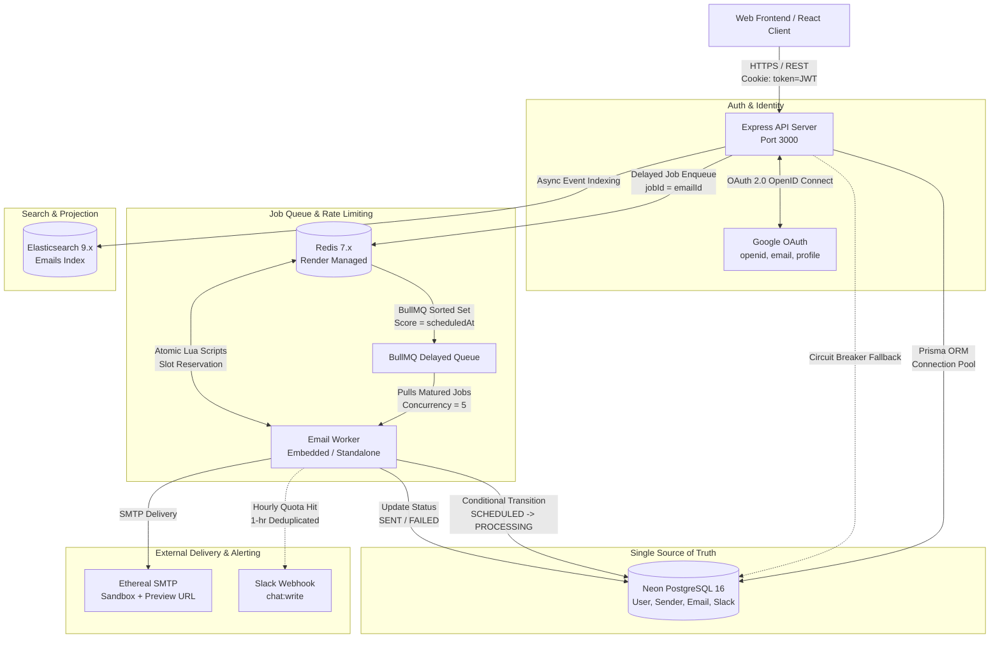

# Architecture & System Design

This document provides a comprehensive technical overview of the architecture, design principles, data models, and architectural assumptions of **PreachInbox Sched**.

---

## 1. High-Level System Architecture

PreachInbox Sched is designed as an asynchronous, event-driven email scheduling and dispatch engine built with TypeScript, Node.js, Express, BullMQ, Redis, PostgreSQL (Neon), and Elasticsearch.



---

## 2. Component Responsibilities & Guarantees

| Component | Technology | Primary Responsibility | Critical Guarantees |
| :--- | :--- | :--- | :--- |
| **Relational Database** | PostgreSQL 16 (Neon) via Prisma ORM | Single Source of Truth | Authoritative state of all user accounts, senders, and email statuses (`SCHEDULED`, `PROCESSING`, `SENT`, `FAILED`). Enforces multi-tenant data isolation via indexed `userId` foreign keys. |
| **In-Memory Coordination** | Redis 7.x (Render) via `ioredis` | Queue Storage & Rate Limiting | Stores BullMQ delayed jobs in durable sorted sets (`zset`). Executes atomic Lua scripts for inter-email spacing reservations and hourly quotas. |
| **Job Queue & Scheduling** | BullMQ 5.x | Deterministic Delayed Execution | Millisecond-precision scheduling backed by Redis epoch timestamps. Zero cron loops, zero database polling. |
| **Search Engine** | Elasticsearch 9.x (Elastic Cloud) | Multi-Match Text Search | High-performance search across `recipient`, `subject`, and `body`. Ingestion is asynchronous and failure-tolerant. |
| **Search Circuit Breaker** | PostgreSQL Fallback Engine | High Availability | If Elasticsearch is unreachable or times out, searches automatically route to PostgreSQL `ILIKE` queries with zero downtime. |
| **SMTP Delivery Engine** | Nodemailer (Ethereal SMTP) | Mail Transmission | Dispatches emails to safe test mailboxes with auto-generated web preview links. |
| **Alerting System** | Slack OAuth 2.0 Webhooks | Operational Alerting | Alerts team channels when a sender reaches their hourly quota ($200\text{ emails/hr}$). Rate-limited to at most 1 alert per sender per hour via Redis deduplication. |

---

## 3. Core Design Principles

### 1. PostgreSQL is the Sole Source of Truth
Redis and Elasticsearch are treated as transient or derived projections:
- If Redis restarts or is cleared, the actual state of an email is always determined by PostgreSQL.
- If Elasticsearch goes offline, search queries seamlessly fall back to relational queries in PostgreSQL.
- Emails are never marked as `SENT` or `FAILED` in Redis or Elasticsearch without first being committed in PostgreSQL.

### 2. Strict Avoidance of Cron for Scheduling
Traditional email schedulers rely on periodic cron jobs (e.g. running every 1 or 5 minutes) executing `SELECT * FROM "Email" WHERE scheduledAt <= NOW()`.
- **Why we avoid Cron**:
  - Cron lacks millisecond precision and introduces arbitrary dispatch delays.
  - SQL polling queries place continuous, wasteful load on relational database CPU and connection pools.
  - Scaling worker processes with cron leads to row contention, race conditions, and deadlocks.
- **BullMQ Delayed Jobs**:
  - Each email is enqueued with an exact millisecond delay: `delay = Math.max(0, targetTime.getTime() - Date.now())`.
  - Redis stores the job in a sorted set (`zset`) with the target epoch millisecond as its score.
  - Redis wakes the worker exactly when the timestamp matures. There is **zero database polling**.

### 3. Non-Blocking Event Loops (No `sleep()`)
Worker threads never execute `await sleep(2000)` to throttle email dispatch rates:
- Sleeping inside an active Node.js worker blocks the event loop, hoards concurrency slots, and exhausts database connection pools.
- Instead, the worker executes an **atomic Redis Lua reservation script**:
  - If a slot is available, the email dispatches immediately.
  - If the slot is in the future, the worker reschedules the job via `job.moveToDelayed(targetTime, token)` and immediately exits the tick, freeing the thread to process emails from other senders.

### 4. Dual Authentication Architecture (Google OAuth 2.0 & Email/Password)
The backend supports two authentication mechanisms, issuing unified JWT session cookies:
- **Google OAuth 2.0 OpenID Connect** (`openid`, `email`, `profile`): Instant zero-config browser login. Non-sensitive scopes avoid verification requirements.
- **Traditional Email & Password**: Registration (`POST /api/auth/register`) and login (`POST /api/auth/login`) secured with `bcryptjs` (10 salt rounds).
- Both mechanisms automatically provision a verified default `Sender` identity and set secure `HttpOnly; SameSite=Lax` cookies.

---

## 4. Database Schema (Prisma Data Model)

The database schema enforces strict relational integrity, cascade deletions, and targeted performance indexes:

```prisma
generator client {
  provider = "prisma-client-js"
}

datasource db {
  provider = "postgresql"
  url      = env("DATABASE_URL")
}

enum EmailStatus {
  SCHEDULED
  PROCESSING
  SENT
  FAILED
}

model User {
  id              String           @id @default(uuid())
  email           String           @unique
  name            String
  avatar          String?
  googleId        String?          @unique
  password        String?
  createdAt       DateTime         @default(now())
  updatedAt       DateTime         @updatedAt

  senders         Sender[]
  emails          Email[]
  slackConnection SlackConnection?

  @@index([email])
}

model Sender {
  id        String   @id @default(uuid())
  userId    String
  email     String
  name      String
  createdAt DateTime @default(now())
  updatedAt DateTime @updatedAt

  user      User     @relation(fields: [userId], references: [id], onDelete: Cascade)
  emails    Email[]

  @@unique([userId, email])
  @@index([userId])
}

model Email {
  id           String      @id @default(uuid())
  userId       String
  senderId     String
  recipient    String
  subject      String
  body         String
  status       EmailStatus @default(SCHEDULED)
  scheduledAt  DateTime
  sentAt       DateTime?
  failedAt     DateTime?
  errorMessage String?
  createdAt    DateTime    @default(now())
  updatedAt    DateTime    @updatedAt

  user         User        @relation(fields: [userId], references: [id], onDelete: Cascade)
  sender       Sender      @relation(fields: [senderId], references: [id], onDelete: Cascade)

  @@index([userId, status])
  @@index([senderId, status])
  @@index([scheduledAt])
  @@index([status])
}

model SlackConnection {
  id          String   @id @default(uuid())
  userId      String   @unique
  slackUserId String
  teamId      String
  teamName    String
  accessToken String
  channelId   String?
  channelName String?
  createdAt   DateTime @default(now())
  updatedAt   DateTime @updatedAt

  user        User     @relation(fields: [userId], references: [id], onDelete: Cascade)

  @@index([userId])
}
```

---

## 5. Architectural Assumptions & System Boundaries

### 1. Dual-Write Boundary with External SMTP
- External SMTP delivery cannot participate in an ACID transaction with PostgreSQL.
- **Mitigation**:
  1. The worker acquires a row-level conditional lock in PostgreSQL (`UPDATE "Email" SET status = 'PROCESSING' WHERE id = :id AND status = 'SCHEDULED'`) *before* transmitting bytes across the SMTP socket.
  2. If the worker crashes mid-transmission, the record remains in `PROCESSING`. BullMQ's lock prevents concurrent workers from re-sending.
  3. Upon successful SMTP receipt, the worker atomically transitions the status to `SENT`.

### 2. Timezone Handling & Date Representation
- **Assumption**: All timestamps stored in PostgreSQL, indexed in Elasticsearch, and transmitted across the REST API are in **ISO 8601 UTC** format (e.g. `2026-09-06T12:00:00.000Z`).
- The frontend client is responsible for localizing UTC timestamps into the user's local timezone.

### 3. Rate-Limiting Windows: Discrete UTC Hour Buckets
- Hourly limits ($200\text{ emails/hour/sender}$) use discrete UTC hour windows (`YYYY-MM-DD-HH`).
- This design allows atomic Lua counter increments with a sliding 2-hour TTL in Redis, eliminating the high memory overhead of storing individual timestamps in sliding-window sorted sets.
- When an hourly quota is hit, excess emails are rescheduled to the top of the next UTC hour window (zero emails are dropped).

### 4. Single-Service vs Standalone Worker Architecture
- In production, the worker can run as an isolated daemon (`npm run worker`).
- On cost-constrained deployments (such as Render's Free tier), the worker runs **embedded inside the main web server process** (`backend/src/server.ts`).
- Because BullMQ utilizes distributed Redis locking, running embedded or standalone maintains identical concurrency and idempotency semantics.

### 5. Browser Privacy Extensions & OAuth URL Parameters
- Browser privacy extensions (such as **ClearURLs** or Brave Shields in strict mode) strip URL parameters from Google OAuth redirects (such as `part`, `rapt`, `xsrf`), causing Google's `signin/oauth/v3/consent` endpoint to return an HTTP 400 Bad Request error.
- Users and testers running such extensions should whitelist `accounts.google.com` or use standard browser profiles.
- A development login bypass (`GET /api/auth/dev-login`) is also provided to enable instant, unblocked local frontend development.

---

## 6. Related Documentation

- **[Scheduling, BullMQ Queues & Idempotency](scheduling-and-queues.md)**
- **[Complete REST API Reference](api-reference.md)**
- **[Frontend Architecture & UI Guide](frontend.md)**
- **[Deployment & Cloud Operations Guide](deployment-and-operations.md)**
- **[Vercel Frontend Deployment](vercel-deployment.md)**
- **[Root Repository Overview](../README.md)**

