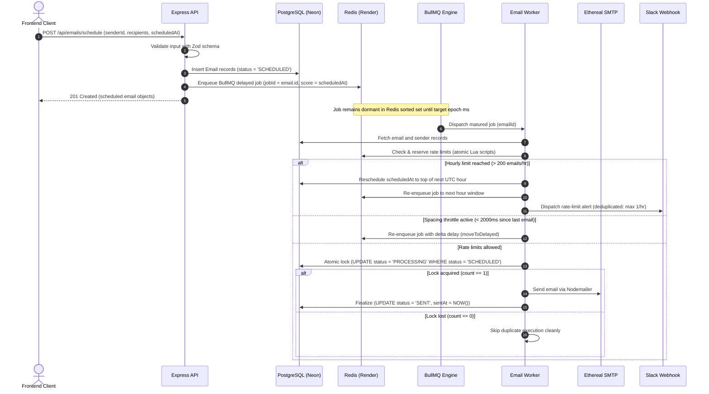

# Scheduling, BullMQ Queues & Idempotency

This document details the scheduling lifecycle, BullMQ queue architecture, restart persistence, and idempotency guarantees in **PreachInbox Sched**.

---

## 1. End-to-End Scheduling Lifecycle



---

## 2. Why BullMQ Delayed Jobs Instead of Cron?

A strict requirement of this architecture is **zero cron-based scheduling**. The table below highlights the architectural differences:

| Dimension | Cron-Based Polling | BullMQ Delayed Jobs (Our Implementation) |
| :--- | :--- | :--- |
| **Precision** | Interval-based (e.g., runs once every 60 seconds). A job scheduled for `14:02:15` will wait until `14:03:00`. | **Millisecond precision**. Jobs execute at the exact epoch millisecond specified. |
| **Database Contention** | Repeatedly runs `SELECT * FROM "Email" WHERE scheduledAt <= NOW()`. Taxes database CPU, I/O, and pool connections even when idle. | **Zero database polling**. Redis stores dormant jobs in a sorted set (`zset`). The database is only touched when a job matures. |
| **Distributed Concurrency** | Scaling worker instances requires complex row-level SQL locking (`SELECT ... FOR UPDATE SKIP LOCKED`) which risks deadlock and connection exhaustion. | **Native Redis distributed locks**. BullMQ manages job claims via atomic Lua scripts with zero SQL contention. |
| **Ad-Hoc Flexibility** | Awkward to schedule arbitrary one-off dates across thousands of distinct users. | Every job is an independent, first-class delayed task. |
| **Event-Loop Efficiency** | Requires cron intervals or `sleep()` loops inside worker threads. | Non-blocking asynchronous timers managed natively by Redis and BullMQ. |

---

## 3. Restart Persistence Guarantees

### What happens when the server, worker, or database restarts?

1. **Redis Sorted Set Persistence**:
   When an email is scheduled, BullMQ adds the job to a Redis sorted set:
   ```text
   Key: bull:email-queue:delayed
   Score: <Epoch millisecond timestamp of scheduledAt>
   Value: <Job payload: { emailId: "uuid" }>
   ```
   Redis keeps this data persisted in memory and periodically flushes to disk (RDB/AOF).

2. **Zero Job Re-creation on Boot**:
   Neither the API server nor the worker recreates jobs on startup. The queue is never re-seeded or wiped from memory.

3. **No "Day 1" Resets**:
   If an email is scheduled for 3 days into the future and the server reboots 10 times, the job's scheduled target time remains unchanged in Redis.

4. **Automatic Catch-Up of Matured Jobs**:
   If the worker process is offline when a job matures (e.g., during maintenance or a service restart), the moment the worker process boots, BullMQ identifies that the job's epoch score is $\le \text{now()}$, shifts it to the `active` queue, and processes it immediately.

5. **Automated Verification**:
   This guarantee is strictly verified by [`backend/tests/queue-restart.test.ts`](file:///home/srp/Documents/Work/Projects/preach-inbox-sched/backend/tests/queue-restart.test.ts):
   - Enqueues a delayed job in Redis.
   - Terminates all active worker instances.
   - Waits for the delay timer to mature while the worker is offline.
   - Spawns a fresh worker instance.
   - Proves the matured job is processed and delivered cleanly without data loss.

---

## 4. 3-Layer Idempotency & Duplicate Prevention

To guarantee that **no email is ever sent more than once**, the system enforces three independent defense layers:

```text
Layer 1: Deterministic BullMQ Job ID
         jobId = email.id
         (Prevents duplicate job creation in Redis)
                        │
                        ▼
Layer 2: Worker Pre-Execution Check
         if (email.status !== 'SCHEDULED') return;
         (Skips jobs already marked as SENT or PROCESSING)
                        │
                        ▼
Layer 3: Atomic PostgreSQL Conditional Update Lock
         UPDATE "Email" SET status = 'PROCESSING'
         WHERE id = :id AND status = 'SCHEDULED';
         (Guarantees concurrency isolation across multiple workers)
```

### Layer 1: Deterministic BullMQ Job ID
In [`backend/src/queue/email.queue.ts`](file:///home/srp/Documents/Work/Projects/preach-inbox-sched/backend/src/queue/email.queue.ts):
```typescript
await emailQueue.add(
  'send-email',
  { emailId },
  {
    jobId: emailId, // Enforces uniqueness in Redis
    delay: safeDelay,
  }
);
```
BullMQ rejects any attempt to enqueue a job with an ID that already exists in the queue, preventing duplicate scheduling at the API boundary.

### Layer 2: Worker Pre-Execution Check
When a worker picks up a matured job, it inspects the PostgreSQL record before doing any work:
```typescript
const email = await prisma.email.findUnique({
  where: { id: emailId },
  include: { sender: true },
});

if (!email || email.status !== 'SCHEDULED') {
  logger.warn(`Email ${emailId} is in status '${email?.status}'. Skipping duplicate execution.`);
  return;
}
```

### Layer 3: Atomic State Transition Lock
To prevent race conditions where two workers concurrently process the same job:
```typescript
const updateResult = await prisma.email.updateMany({
  where: {
    id: emailId,
    status: 'SCHEDULED',
  },
  data: {
    status: 'PROCESSING',
  },
});

if (updateResult.count === 0) {
  logger.warn(`Email ${emailId} concurrent transition lost. Skipping.`);
  return;
}
```
In relational databases, `UPDATE ... WHERE status = 'SCHEDULED'` holds an exclusive row-level lock during evaluation. Exactly one worker will obtain `count === 1`. Any competing worker receives `count === 0` and terminates without touching the SMTP socket.

---

## 5. Rate Limiting & Throttling Engine

Rate limits are enforced per-sender in Redis using atomic Lua scripts in [`backend/src/workers/rate-limiter.ts`](file:///home/srp/Documents/Work/Projects/preach-inbox-sched/backend/src/workers/rate-limiter.ts).

### 1. Inter-Email Delay Throttling (`MIN_EMAIL_DELAY_MS = 2000`)
To protect sender reputation and prevent SMTP connection flooding:
- A Lua script inspects key `email-delay:{senderId}` in Redis.
- Rather than executing `await sleep(2000)` inside worker threads (which blocks event loops and exhausts database connection pools), the script atomically reserves the next available timestamp slot:
  $$\text{nextAvailable} = \max(\text{now}, \text{currentAvailable}) + \text{MIN\_DELAY}$$
- If the current time is before the reserved slot, the script returns the exact delta in milliseconds.
- The worker moves the job back to BullMQ delayed state:
  ```typescript
  await job.moveToDelayed(Date.now() + delayMs, token);
  ```

### 2. Hourly Quota Enforcement (`MAX_EMAILS_PER_HOUR_PER_SENDER = 200`)
- Key: `email-rate:{senderId}:{YYYY-MM-DD-HH}` with a 2-hour sliding TTL.
- Atomic Lua script increments and checks:
  ```lua
  local current = tonumber(redis.call('GET', rateKey) or "0")
  if current >= maxPerHour then
    return { 0, current }
  else
    local newCount = redis.call('INCR', rateKey)
    if newCount == 1 then
      redis.call('EXPIRE', rateKey, 7200)
    end
    return { 1, newCount }
  end
  ```

### 3. Zero-Drop Rescheduling Policy
When a sender hits their hourly quota:
1. **The email is never dropped, discarded, or marked as FAILED.**
2. The system calculates milliseconds until the top of the next UTC hour window:
   ```typescript
   export function getMillisUntilNextHour(now = new Date()): number {
     const nextHour = new Date(now);
     nextHour.setUTCHours(now.getUTCHours() + 1, 0, 0, 0);
     return Math.max(1000, nextHour.getTime() - now.getTime());
   }
   ```
3. The database `scheduledAt` timestamp is updated to reflect the new delivery window.
4. The BullMQ job is moved to delayed status for that duration.
5. A deduplicated Slack alert is triggered (at most once per sender per hour via `slack-alerted:${windowKey}`).

---

## 6. Behavior Under 1,000+ Email Batch Load (CSV Upload)

When a user imports a CSV of 1,000 recipients scheduled at the same second:

1. **Storage**: All 1,000 records are written to PostgreSQL and enqueued in BullMQ as delayed jobs in Redis.
2. **Memory Safety**: Jobs are **not** loaded into Node.js heap memory simultaneously. BullMQ workers only pull up to `WORKER_CONCURRENCY` (default: 5) jobs at a time.
3. **Automatic Serialization**:
   - Job 1 executes at $T = 0\text{s}$.
   - Job 2 is delayed to $T = 2\text{s}$.
   - Job 3 is delayed to $T = 4\text{s}$.
   - ...
   - Job 200 is delayed to $T = 398\text{s}$.
4. **Hourly Cutoff & Rollover**:
   - Jobs 201 through 1,000 hit the `MAX_EMAILS_PER_HOUR_PER_SENDER = 200` quota check.
   - The worker automatically moves them to the next UTC hour window ($T + 3600\text{s}$).
   - A single Slack alert is dispatched to notify the team.
   - CPU, memory, and database connections remain flat and stable throughout the entire dispatch cycle.
